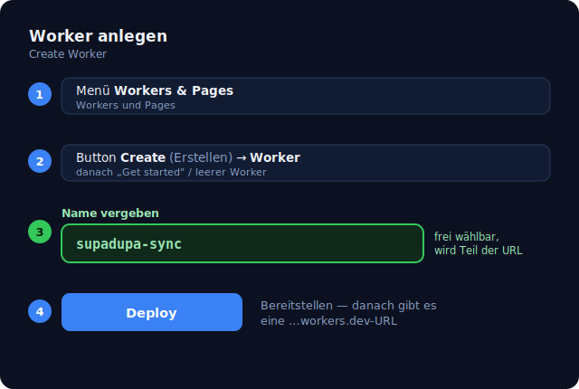
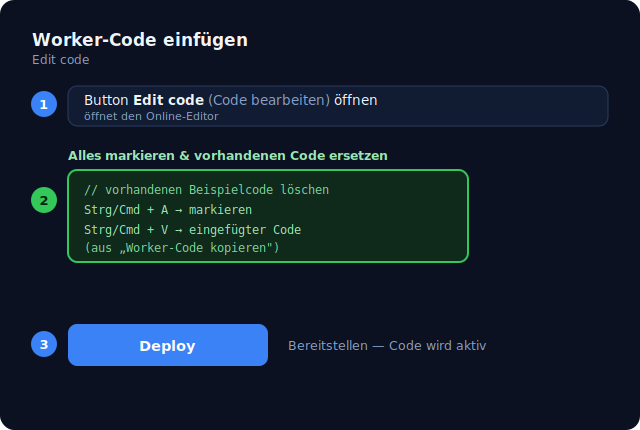
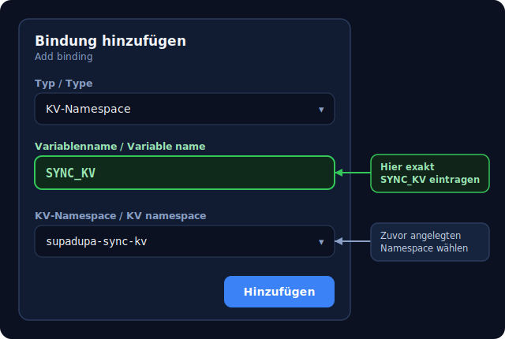
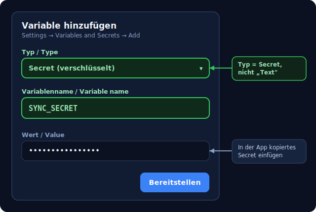

# Cloudflare-Setup — deine private Cloud-DB in 4 Schritten

Damit deine Buchungen auf allen Geräten verfügbar sind, betreibst du deinen
**eigenen** kleinen Cloudflare-Worker. Kostenlos (Free-Tier), keine laufenden
Kosten, keine zentrale Datenhaltung. Einmal eingerichtet — danach reicht auf
neuen Geräten URL + Secret (+ optionale Passphrase).

## 1. Cloudflare-Konto anlegen

Kostenloses Konto unter <https://dash.cloudflare.com/sign-up>. E-Mail
bestätigen, 2-Faktor aktivieren empfohlen.

## 2. Worker einrichten — ohne GitHub (empfohlen)

So braucht niemand Zugriff auf ein bestimmtes Repository:

1. In der App **„Worker-Code kopieren"** tippen (Einstellungen → Cloudflare oder
   im Cloud-Wizard). Der komplette Worker-Code (`worker-data/data-store-worker.js`)
   liegt damit in der Zwischenablage.
2. Im [Cloudflare-Dashboard](https://dash.cloudflare.com/) → **Workers & Pages**
   → **Create** → **Worker** anlegen (Name z. B. `supadupa-sync`) → **Deploy**.
3. **Edit code** öffnen, alles markieren, Code **einfügen** → **Deploy**.
4. Reiter **Bindings** (eigener Reiter neben **Settings**, *nicht* darunter) →
   **Add binding** → Typ **KV namespace**. Bei **Variable name** genau
   **`SYNC_KV`** eintragen, bei **KV namespace** einen neuen Namespace anlegen
   (dessen Name ist egal). Siehe Bild im deutschen Abschnitt unten.
5. **Settings → Variables and Secrets**: **`SYNC_SECRET`** als *Secret* setzen
   (Wert in der App per „Secret generieren").

Am Ende hast du eine URL wie `https://supadupa-sync.DEIN-NAME.workers.dev`.

### Alternative: 1-Klick per GitHub (nur mit öffentlichem Repo)

Der Button **forkt** das angegebene Repo — funktioniert daher nur, wenn die
Worker-Vorlage in einem **öffentlichen** Repository liegt. Bei privatem Repo nimm
den Code-Weg oben.

## 3. Geheimnis (`SYNC_SECRET`) setzen

In der App auf **„Secret generieren"** tippen (erzeugt ein starkes Passwort) und
kopieren. Dann im Cloudflare-Dashboard:

> Worker `supadupa-sync` → **Settings** → **Variables and Secrets** →
> Variable `SYNC_SECRET` als **Secret** hinzufügen → den kopierten Wert einfügen
> → speichern.

Denselben Wert trägst du in der App ins Feld **Secret** ein.

## 4. Verbinden & testen

In der App die `…workers.dev`-URL ins Feld **Worker URL** eintragen und
**„Verbindung testen"** drücken — grüner Haken = fertig. Mit **„Lokal →
Cloudflare"** lädst du deine Daten erstmalig hoch.

## Cloudflare-Dashboard auf Deutsch

Die Schritte oben nennen die **englischen** Menüpunkte. Steht dein Dashboard auf
Deutsch (oben rechts beim Profil unter **Sprache / „Language"** umstellbar), heißen
dieselben Punkte so:

| Englisch | Deutsch |
| --- | --- |
| Workers & Pages | Workers und Pages |
| Create | Erstellen |
| Worker | Worker |
| Deploy | Bereitstellen |
| Edit code | Code bearbeiten |
| Settings | Einstellungen |
| Bindings | Bindungen |
| Add binding | Bindung hinzufügen |
| KV Namespace | KV-Namespace |
| Variable name | Variablenname |
| Variables and Secrets | Variablen und Geheimnisse (Secrets) |
| Add variable | Variable hinzufügen |
| Secret | Geheimnis (Secret) |
| Save / Deploy | Speichern / Bereitstellen |

### Schritt 2 auf Deutsch — Worker einrichten

1. In der App **„Worker-Code kopieren"** tippen (Einstellungen → Cloudflare oder
   im Cloud-Wizard).
2. Im [Cloudflare-Dashboard](https://dash.cloudflare.com/) → **Workers und Pages**
   → **Erstellen** → **Worker** anlegen (Name z. B. `supadupa-sync`) →
   **Bereitstellen**.

   

3. **Code bearbeiten** öffnen, alles markieren, Code **einfügen** →
   **Bereitstellen**.

   

4. Reiter **Bindungen** öffnen — das ist ein **eigener Reiter auf derselben Ebene
   wie „Einstellungen"**, *nicht* darunter. Dann **Bindung hinzufügen** klicken und
   als Typ **KV-Namespace** wählen (siehe Bild):
   - Feld **Variablenname** → genau **`SYNC_KV`** eintragen (so heißt es im
     Worker-Code, `env.SYNC_KV`).
   - Feld **KV-Namespace** → **Neu erstellen** wählen (oder vorhandenen nehmen);
     der Name dieses Namespace ist **egal** (z. B. `supadupa-sync-kv`). Falls dort
     schon ein Namespace steht, kannst du gefahrlos einen neuen anlegen.

   

5. **Einstellungen → Variablen und Geheimnisse**: **`SYNC_SECRET`** als
   *Geheimnis (Secret)* setzen (Wert in der App per „Secret generieren"). Typ muss
   **Secret** sein (nicht „Text"):

   

Am Ende hast du wieder eine URL wie `https://supadupa-sync.DEIN-NAME.workers.dev`.

### Schritt 3 auf Deutsch — Geheimnis (`SYNC_SECRET`) setzen

In der App auf **„Secret generieren"** tippen und kopieren. Dann im Dashboard:

> Worker `supadupa-sync` → **Einstellungen** → **Variablen und Geheimnisse** →
> Variable `SYNC_SECRET` als **Geheimnis (Secret)** hinzufügen → den kopierten
> Wert einfügen → speichern.

Denselben Wert trägst du in der App ins Feld **Secret** ein.

> Hinweis: Die Variablennamen **`SYNC_KV`** und **`SYNC_SECRET`** bleiben in jeder
> Sprache **unverändert** — sie werden nicht übersetzt und müssen exakt so
> geschrieben werden. Cloudflare passt die Menü-Übersetzungen gelegentlich an;
> weicht ein Begriff ab, hilft die Tabelle oben zum Wiedererkennen.

## Optional, empfohlen: Verschlüsselung (Passphrase)

Setzt du im Feld **Passphrase** ein Geheimwort, werden deine Daten **vor** dem
Hochladen im Browser verschlüsselt (Zero-Knowledge) — der Worker sieht nur
Chiffrat. Wichtig: **auf jedem Gerät dieselbe Passphrase** eingeben. Geht sie
verloren, sind die Cloud-Daten nicht mehr lesbar.

## Weiteres Gerät hinzufügen

Auf dem neuen Gerät einfach **dieselbe** Worker-URL, **dasselbe** Secret und
(falls genutzt) **dieselbe** Passphrase eintragen, dann **„Cloudflare → Lokal"**.
Kein erneutes Worker-Deployment nötig.
